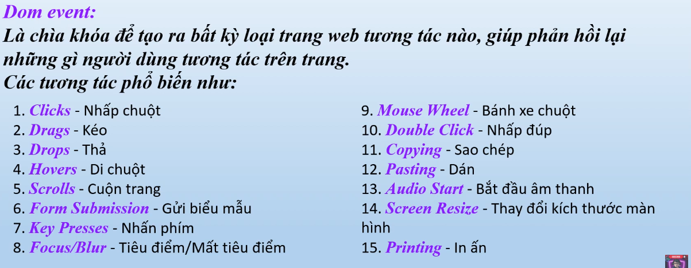

# Trainning JS

## Remove $& removeChild

### remove()

- Xóa phần tử được chọn. kh có giá trị trong dấu ngoặc
- VD:
  - parent.remove()
  - child.remove()

### removeChild()

- Xóa phần tử con trong một phần tử cha
- VD: parent.removeChild(child)

## DOM event

- click
- scroll
  ...
  

### inline event

- Là một cách đơn giản để thêm sự kiện vào một element HTML bằng cách sử dụng thuộc tính của phần tử đó.
  -->Nhược điểm: khó quản lý --> tái sử dụng kém
- VD:
  - <button onclick=""></button> // click 1 cái
  - <button ondblclick=""></button> // click 2 cái
